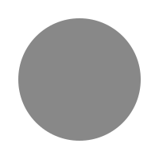
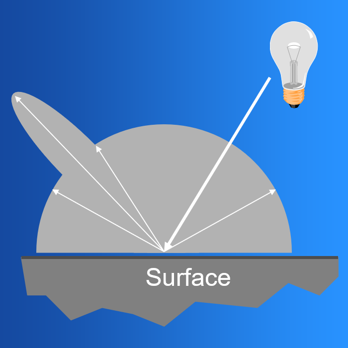
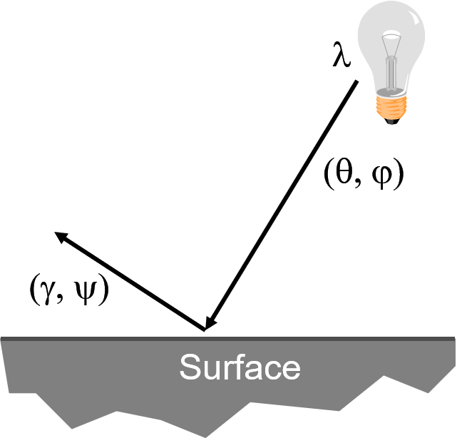
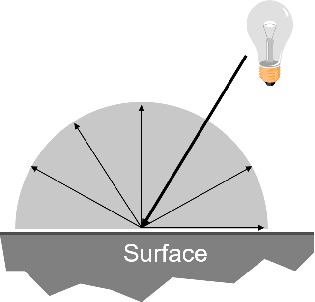

Pre-requisites: You may want to read the theory chapter on Color Vision before starting this chapter.

<a href="https://docs.google.com/presentation/d/12p68PGV0_iGpp5iei6tqa0ChdOcJ7vV9Ep17kpbSQ4E/edit?usp=sharing" class="btn btn-info">Slide Deck</a>

In this chapter, we needed to figure out how to represent reflectance.
When light hits an object, some of it is absorbed and some of it is reflected.

The manner in which light interacts with any given object is what gives the object its appearance.
It determines the color, e.g. a red ball absorbs green and blue light so it appears red.
It also determines other material properties, such as shininess.

A metal ball reflects light differently than, say, a rock.
This has to do with properties of the material itself.

This interaction is quite complicated.
To simulate it perfectly would require a lot of physics understanding and a lot of computation.
We would also need to have a deep understanding of the physical properties of different media,
which we don't necessarily have access to.

So instead we will come up with a relatively simple model and live with it.

---

Why do we care about lighting?

Lighting makes things look 3D.

Without lighting:

With lighting:

Some definitions:

**Shading:** the process of assigning a colors to pixels

**Illumination:** the transport of photons from light sources via direct and indirect paths

There are two components of illumination:

**1.** Light sources with:

- Color (emittance spectrum)
- Geometry (position and direction)
- Falloff (directional attenuation)

**2.** Surface properties with:

- Color (reflectance spectrum)
- Geometry (position, orientation, micro-structure)

To model illumination, there are two kinds of models we can use:

**Empirical models** approximate observed phenomena.

**Physically-based models** apply physical equations in an attempt to simulate reality.

For now we will focus on empircal models.
We will also focus on local approximations, not global ones.
For a discussion of global models and physically based models, take CSC 473 :-)

## General Reflectance Model

Light can come in from any different direction

To shade, we need to model how light leaves for every possible direction.

### Light Sources

In general we can model a light source using the following expression:

$$ I_L (x, y, z, \theta, \phi, \lambda) $$

Here, $$ I_L $$ is a function that gives us the intensity of light energy

- leaving a light source $$ L $$
- arriving at location $$ (x, y, z) $$
- from direction $$ (\theta, \phi) $$
- with wavelength $$ \lambda $$

In real time computer graphics we tent to use one a few simple empircal models of light sources:

- point lights
- directional lights
- spot lights
- ambient light

#### Point Lights

Light rays eimt from a point light radially and diverge from the source (called omni-directional point sources).
This is a fair approximation of a light bulb.

The light from this type of source is **geometrically attenuated**.
This is a frightening way of saying "it gets dimmer when you get farther away".
The reason we use the frightening term is to demonstrate a point:
It's not that the light beams/photons/whatever loses energy as we get further away.
Rather, the further away you are looking from a point light, the larger the illuminated area.
So there is less light.

For:

- Intensity $$ I_0 $$
- Position $$ P $$
- Factors $$ a, b, c $$ for attenuation with distance $$ d $$

$$ I_L = \frac{I_0}{a + b d + c d^2} $$

#### Directional Lights

For directional light sources, all of the rays have a common direction and no point of origin.
This models a light source at infinity - infinitely far away.
*Sunlight* is the prime example of this.
Of course the sun is actually a point light, but it is so far away and so bright that it is reasonable to model it this way.

For directional lights, there is **no attenuation** with distance.

$$ I_L = I_0 $$

#### Spot Lights

A spot light models a point light source with direction.

For:

- Intensity $$ I_0 $$
- Position $$ P $$
- Direction $$ D $$
- Factors $$ a, b, c $$ for attenuation with distance $$ d $$

$$ I_L = \frac{I_0 (D \cdot L)}{a + b d + c d^2} $$

#### Ambient Light

This is not a light source in the same sense as the above, and we will model it differently in our empircal model.

Even though an object in is a scene is not directly lit, it will still be visible.
If you walk outside, you'll find that shadows are dark but not pitch black.
This is because light is reflected indirectly from nearby objects.

To model this indirect illumination, we use an ambient light source.
Ambient light has no spatial or directional characteristics.
The amount of ambient light is a constant for all surfaces in the scene.

### Reflectance

Light can come in from any direction.
To shade, we need to model how light leaves for every possible direction.

$$ R_S (\theta, \phi, \gamma, \psi, \lambda) $$

For a given surface, this describes the amount of light energy

- arriving from direction $$ (\theta, \phi) $$
- leaving in direction $$ (\gamma, \psi) $$
- with wavelength $$ \lambda $$

Ideally, we would measure the radiant energy for all combinations of indicent angles for a given material.
That would give us a function that tells us the outgoing light in all directions for some incoming light.

Such a function would be a reflection function.
Since it describes how light is distributed, it's a distribution function.
And since it takes both an incident and outward direction, it's bi-directional.

It's a **bi-direction reflection distribution function**.

$$ BRDF_\lambda (\theta, \phi, \gamma, \psi) $$

These are difficult to measure in practice.
Often we model them analytically.

## Phong Reflection Model

A simple analytic model proposed by Phong, the sum of:

- diffuse reflection
- specular reflection
- ambient

### Diffuse Reflection

Assume the surface reflects equally in all directions.
An ideal diffuse surface is, at the microscopic level, a very rough surface.

Example: chalk, clay

Ideal diffuse reflectors reflect light according to **Lambert's cosine law**.

This type of diffuse lighting, or a shading model that uses only this part, is called **lambertian**.
The reflected intensity is independent of the viewing direction.
It depends only on the angle of incident light.

$$ I_d = k_d ( N \cdot L ) I_L $$

- $$ I_L $$: the incoming light intensity
- $$ K_d $$: diffuse reflection coefficient
- $$ N $$: surface normal
- $$ L $$: light direction

### Specular Reflection

$$ I_s = k_s ( V \cdot R ) ^ \alpha I_L $$

- $$ I_L $$: the incoming light intensity
- $$ K_s $$: specular reflection coefficient
- $$ V $$: view vector
- $$ R $$: reflection vector
- $$ \alpha $$: shininess constant

### Ambient

$$ I_a = k_a $$

- $$ K_s $$: ambient reflection coefficient

## Blinn-Phong Reflection Model

### Half-Vector Approximation

The half-vector approximation started as an optimization to improve shading performance.
It could be pre-computed for a given lighting and view configuration and was thus cheaper than
computing the reflection vector for each fragment.

Nowadays the optimization is meaningless since, generally, a difference of a few FLOPS in a shader doesn't matter
compared to larger concerns like render call count and memory throughput.

But, empirical studies of real-world lighting scenarios show that the half-vector approximation is actually
more accurate in many scenarios.
So it is commonly used.

$$ H = \frac{V + L}{\| V + L \|} $$

Also note that in the planar case, the half-vector approximation is indentical to the standard Phong model.
It's when the view, normal, and light vector are not in the same plane that Blinn-Phong and Phong will be different.

### Specular Reflection

$$ I_s = k_s ( H \cdot N ) ^ \alpha I_L $$

- $$ I_L $$: the incoming light intensity
- $$ K_s $$: specular reflection coefficient
- $$ H $$: half vector
- $$ N $$: surface normal
- $$ \alpha $$: shininess constant
